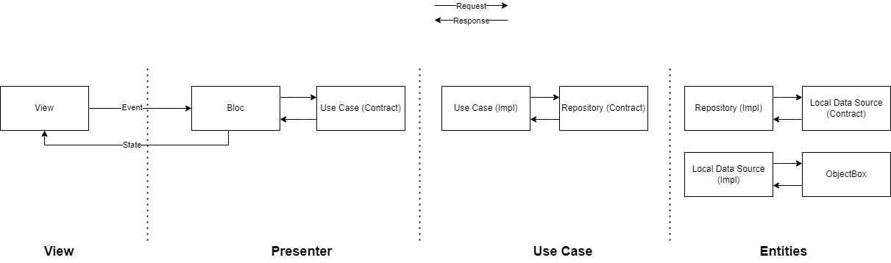

# my_todo_list

A simple application to save your todo list, it can add new todo and mark finished todo.

## Architecture

## Getting Started

This project is a starting point for a Flutter application.

Run app :

- First run `flutter pub get` to get all dependencies
- Run this command to build all generated file `flutter pub run build_runner build`

Run test :

- Run command `flutter test`

## Dependencies

- [flutter_bloc 8.1.2](https://pub.dev/packages/flutter_bloc)
- [get_it 7.2.0](https://pub.dev/packages/get_it)
- [freezed 2.3.2](https://pub.dev/packages/freezed)
- [freezed annotation 2.2.0](https://pub.dev/packages/freezed_annotation)
- [objectbox 1.7.2](https://pub.dev/packages/objectbox)
- [objectbox flutter libs](https://pub.dev/packages/objectbox_flutter_libs)
- [path 1.8.2](https://pub.dev/packages/path)
- [path_provider 2.0.14](https://pub.dev/packages/path_provider)
- [equatable 2.0.5](https://pub.dev/packages/equatable)
- [flutter_svg 2.0.4](https://pub.dev/packages/flutter_svg)

## Dev Dependencies

- [build_runner 2.3.3](https://pub.dev/packages/build_runner)
- [objectbox_generator 1.7.2](https://pub.dev/packages/objectbox_generator)
- [flutter_launcher_icons 0.11.0](https://pub.dev/packages/flutter_launcher_icons)
- [mockito 5.3.2](https://pub.dev/packages/mockito)
- [bloc_test 9.1.1](https://pub.dev/packages/bloc_test)
- [random_string 2.3.1](https://pub.dev/packages/random_string)
